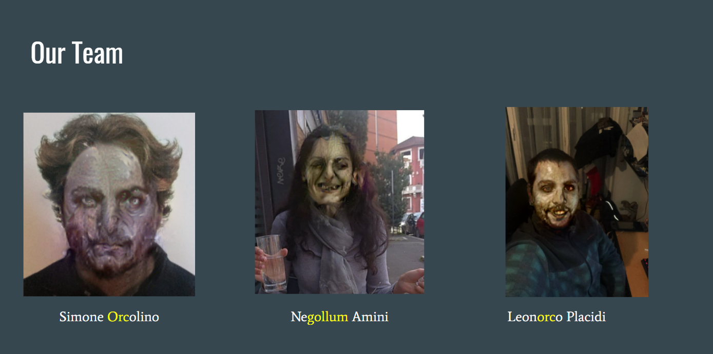

# LOTR-Face-style-transfer
This work is based on the [Automated deep photo style transfer](https://github.com/Spenhouet/automated-deep-photo-style-transfer) tensorflow implementation, for doing the conditional style tranfer on parsed faces.
The face parsing was done using the BiSeNet network, in the implementation of [zllrunning](https://github.com/zllrunning/face-parsing.PyTorch).

