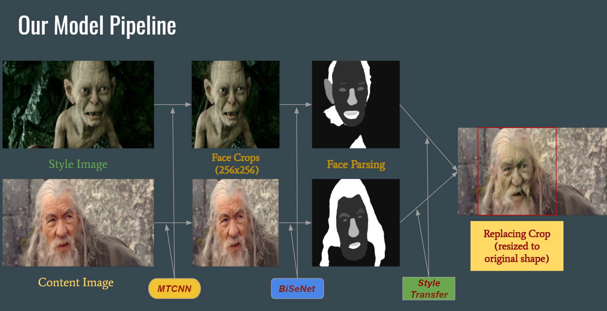

# LOTR-Face-style-transfer
The demo for this project is a [colab notebook](https://colab.research.google.com/drive/1sPkTTJEcRRd9_QnZ3PMt3-LWARZhxoiu), showing some results and example usage. 
In order to run the algorithm on a local machine, please run the jupyter notebook or, from command line, run the python script main.py (after installing requirements contained in requirements.txt),
with the line:

python main.py --content_image path_to_content --style_image path_to_style

Other arguments to be used for obtaining better results are --content_weight, --style_weight and --regularization_weight, 
For which example values can be found inside the notebook, and in general can and should be tuned with respect to intensity of the selected pair of content/style images. 
This work is based on the [Automated deep photo style transfer](https://github.com/Spenhouet/automated-deep-photo-style-transfer) tensorflow implementation, for doing the conditional style tranfer on parsed faces.
The face parsing was done using the BiSeNet network, in the implementation of [zllrunning](https://github.com/zllrunning/face-parsing.PyTorch).

